<div align="center">



<br/>

<a href="https://www.linkedin.com/in/julianosoder/">
  
</a>
<a href="mailto:julianosoder.js@gmail.com">
  
</a>


<br/><br/>


</div>

## 🧠 // about.me

```typescript
const juliano: SoftwareEngineer = {
  location: "Santa Catarina, Brazil 🇧🇷",
  role: "Software Engineer @ large-scale e-commerce",
  codingSince: 2019,
  pronouns: ["he", "him"],

  backend: ["Java 8 → 25", "Spring Boot", "Quarkus", "Kotlin", ".NET", "Node.js", "NestJS", "Python", "Go"],
  frontend: ["Angular", "React", "Vue 3", "TypeScript", "Bootstrap 5"],
  architecture: ["microservices", "REST APIs", "Kafka messaging", "CI/CD pipelines"],
  databases: ["MongoDB", "Oracle"],
  observability: ["Kibana", "Dynatrace"],

  education: {
    postgrad: "Data Science",
    ongoing: "B.Sc. Information Systems",
  },

  currently: {
    building: "personal projects with LLMs & AI automation flows 🤖",
    learning: "CyberSecurity 🔓",
  },
};
```

## 🛠️ // tech.stack

<div align="center">

**`> backend`**


**`> frontend`**


**`> devops & cloud`**


**`> data & tools`**


<br/>


</div>

## 📡 // github.stats

<div align="center">


<br/><br/>


<br/><br/>


</div>

## 🐍 // contribution.snake

<div align="center">

<picture>
  <source media="(prefers-color-scheme: dark)" srcset="https://raw.githubusercontent.com/SoderJuliano/SoderJuliano/output/github-snake-dark.svg" />
  <source media="(prefers-color-scheme: light)" srcset="https://raw.githubusercontent.com/SoderJuliano/SoderJuliano/output/github-snake.svg" />
  
</picture>

</div>

<br/>

<div align="center">

```text
> The quieter you become, the more you are able to hear._
```

<sub>Header font: <a href="https://www.fontspace.com/glitch-goblin-font-f94950">Glitch Goblin</a> by GGBotNet — SIL OFL (see <code>assets/fonts</code>)</sub>

</div>
